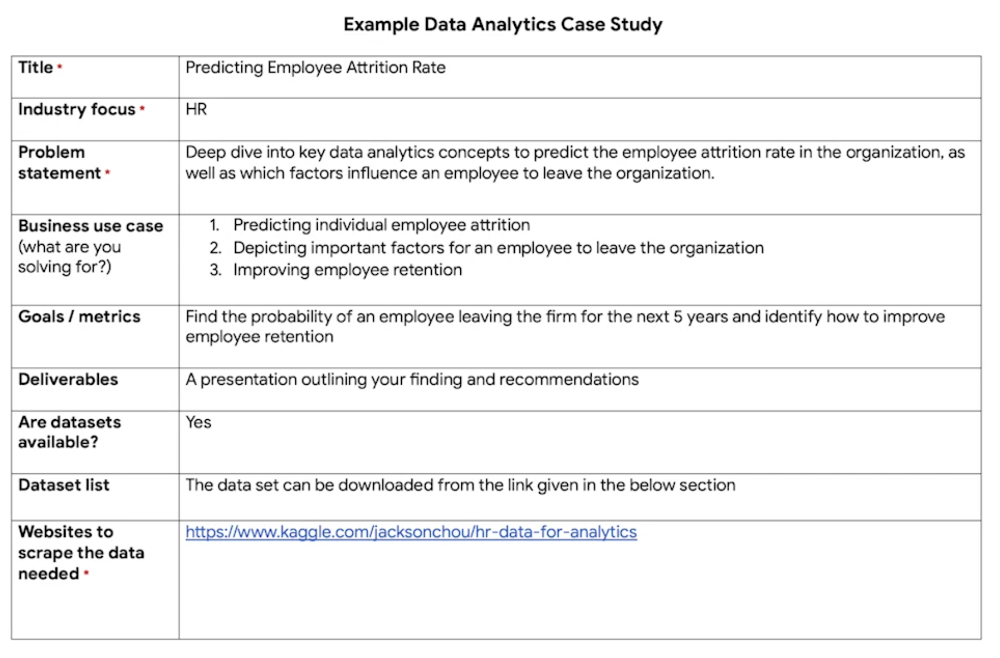

## Capstone basics
### Introducing the capstone project

**Case study**: A common way for employers to assess job skills and gain insight into how you approach common data related challenges.
For example, you might be asked to clean and analyze a data set, offer a proposal around how to measure the success of a project, or figure out and define metrics of success for a specific product.
Usually, there's a time limit for the case study you've been asked to do. But the good news is, your answer to the case study doesn't have to be perfect.
Show off your thought process so that the interviewers can understand how you approach the problem

e.g.

**Portfolio**: Collection of case studies that can be shared with potential employers.
Portfolios can be stored on public websites like GitHub, Kaggle, or Tableau, or on your blog.
Your portfolio can also be linked in your resume.