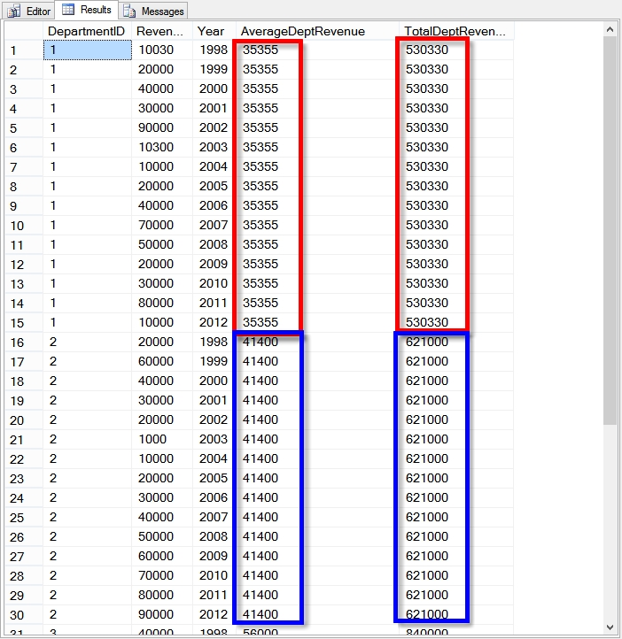
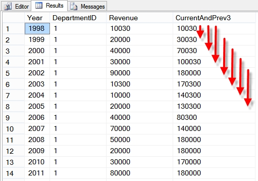
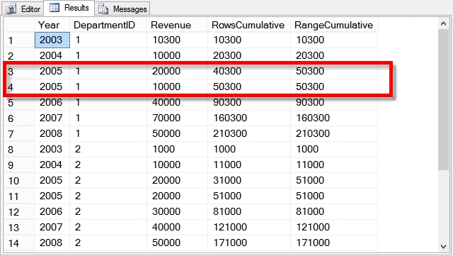

Try it on
https://sqliteonline.com/

## CASE
```sql
SELECT
    CASE
        WHEN genre = 'horror' THEN 'will not watch'
        WHEN genre = 'documentary' THEN 'will watch alone'
        ELSE 'will watch' END AS watch_category, --creating your own category 
    COUNT(movie_title) AS number_of_movies
FROM
    MovieTheater
GROUP BY 1
```

limited to perfect matching
```sql
SELECT
    CASE genre
        WHEN 'horror' THEN 'will not watch'
        ELSE 'will watch' END AS watch_category,
    COUNT(movie_title) AS number_of_movies
FROM
    MovieTheater
GROUP BY 1
```

## COALESCE
Return the first non-null expression in the order specified in the function.
```sql
SELECT
    movie_title,
    COALESCE(Jan_2030, Feb_2030, Mar_2030) AS launched_indicator
    -- Jan_2030, Feb_2030, Mar_2030 are columns
FROM
    MovieLaunches
```

In the workplace, **COALESCE** is often used to make sure that fields don’t contain nulls.
`COALESCE(try_this_field, then_this_field, 0)`

> In BigQuery, this is the same as using the `IFNULL()` function (more about that [here](https://cloud.google.com/bigquery/docs/reference/standard-sql/conditional_expressions#ifnull))

## IF
**IF statements** are similar to CASE statements, but they have one key difference: CASE statements can take multiple conditions, whereas IF statements can't.
```sql
SELECT
    IF(genre='horror', 'will not match', 'will match')
    AS watch_category, 
    COUNT(movie_title) AS number_of_movies
FROM
    MovieTheater
GROUP BY 1
```


## Create (permanent) tables
when you create tables, you want to make sure the same table doesn’t already exist.

**CREATE TABLE IF NOT EXISTS**
```sql
CREATE TABLE IF NOT EXISTS mydataset.FavoriteColorAndMovie
AS
SELECT
    friend,
    color,
    movie
FROM
    Favorite_Colors AS c
INNER JOIN
    Favorite_Movies AS m
ON c.friend = m.friend
```
`CREATE TABLE IF NOT EXISTS` will only create a table if it doesn’t already exist. If it exists, then the query will run but won’t do anything. This is a failsafe so that you don’t accidentally overwrite a potentially important table.

**CREATE OR REPLACE TABLE**
```sql
CREATE OR REPLACE TABLE mydataset.FavoriteColorAndMovie
AS
SELECT
...
```
if you do need to overwrite a table, you can use `CREATE OR REPLACE TABLE`.

## Create temporary tables
Temporary tables exist only for you during your session.
```sql
CREATE TEMP TABLE ExampleTable
AS
SELECT
    colors
FROM
    Favorite_Colors
;

SELECT
...
```

> If you are running two queries at the same time, which you have to do with temporary tables (only available during that session), then you need a semicolon separating each query.

## Deleting tables
Best practice is to add on the `IF EXISTS` as a failsafe.
```sql
DROP TABLE IF EXISTS mydataset.FavoriteColorAndMovie
```


## row_number, rank, dense_rank


The **difference between rank, row_number, and dense_rank is visible when there are duplicate records**.
The row_number gives continuous numbers(rank may be random with duplicates), while rank and dense_rank give the same rank for duplicates, but the next number in rank is as per continuous order so you will see a jump but in dense_rank doesn't have any gap in rankings.

## Rows and Range, Preceding and Following
[](https://stevestedman.com/2013/04/rows-and-range-preceding-and-following/)
new features to Transact SQL (T-SQL) in SQL Server 2012

### OVER Clause Pre SQL Server 2012
```SQL
--First OVER Clause pre SQL 2012
SELECT *,
 avg(Revenue) OVER (PARTITION by DepartmentID) as AverageDeptRevenue,
 sum(Revenue) OVER (PARTITION by DepartmentID) as TotalDeptRevenue
FROM REVENUE
ORDER BY departmentID, year;
```


### OVER Clause
```sql
OVER (   
       [ <PARTITION BY clause> ]  
       [ <ORDER BY clause> ]   
       [ <ROWS or RANGE clause> ]  
      )  
```
```sql
Select *,SUM(salary) Over(order by salary RANGE BETWEEN UNBOUNDED PRECEDING AND CURRENT ROW) as sum_sal from employees

Id          Name                                               Gender     Salary      sum_sal
----------- -------------------------------------------------- ---------- ----------- -----------
6           Aradhya                                            Female     3500        3500
5           Sara                                               Female     4000        7500
2           John                                               Male       4500        12000
3           Pavan                                              Male       5000        32000
1           Mark                                               Male       5000        32000
8           Mary                                               Female     5000        32000
12          Ron                                                Male       5000        32000
11          Tom                                                Male       5500        48500
7           Tom                                                Male       5500        48500
4           Pam                                                Female     5500        48500
9           Ben                                                Male       6500        55000
10          Jodi                                               Female     7000        62000
```


### ROWS PRECEDING or FOLLOWING
```SQL
SELECT Year, DepartmentID, Revenue,
 sum(Revenue) OVER (PARTITION by DepartmentID
 ORDER BY [YEAR]

-- ROWS CURRENT ROW
-- only use the value of the current row
 ROWS CURRENT ROW) as Current,

-- ROWS PRECEDING
-- look at the sum of revenue over 3 year period
 ROWS BETWEEN 3 PRECEDING AND CURRENT ROW) as CurrentAndPrev3

-- ROWS FOLLOWING
 ROWS BETWEEN CURRENT ROW AND 3 FOLLOWING) as CurrentAndNext3
 
-- ROWS PRECEDING AND FOLLOWING
 ROWS BETWEEN 1 PRECEDING AND 1 FOLLOWING) as BeforeAndAfter

-- ROWS UNBOUNDED PRECEDING
-- aggregrates to use the current value, and all values in the partition before the current value
 ROWS UNBOUNDED PRECEDING) as MinRevenueToDate
 
-- ROWS UNBOUNDED FOLLOWING
 ROWS BETWEEN CURRENT ROW AND UNBOUNDED FOLLOWING) as MinRevenueBeyond

FROM REVENUE
ORDER BY departmentID, year;
```

e.g. PRECEDING


#### Shortcut
`Over(order by salary)` is just a short cut of `Over(order by salary RANGE BETWEEN UNBOUNDED PRECEDING AND CURRENT ROW)`

`Over()` is just a short cut for `Over(order by salary ROWS BETWEEN UNBOUNDED PRECEDING AND UNBOUNDED FOLLOWING)`

### ROWS vs RANGE
EREQUEST `RANGE` is only supported with `UNBOUNDED` and `CURRENT ROW` window frame delimiters.
While
`ROWS` support like `between 1 preceding and current row`

For the difference of `ROWS UNBOUNDED` and `RANGE UNBOUNDED`:
```SQL
-- INSERT A DUPLICATE VALUE FOR RANGE UNBOUNDED PRECEEDING
 
INSERT INTO REVENUE
VALUES (1,10000,2005),(2,20000,2005),(3,30000,2005);
 
-- same query as above
SELECT Year, DepartmentID, Revenue,

-- ROWS UNBOUNDED PRECEDING
 sum(Revenue) OVER (PARTITION by DepartmentID
 ORDER BY [YEAR]             
 ROWS UNBOUNDED PRECEDING) as RowsCumulative,
 
-- RANGE UNBOUNDED PRECEDING
 sum(Revenue) OVER (PARTITION by DepartmentID
 ORDER BY [YEAR]
 RANGE UNBOUNDED PRECEDING) as RangeCumulative

FROM REVENUE
WHERE year between 2003 and 2008
ORDER BY departmentID, year;
```

