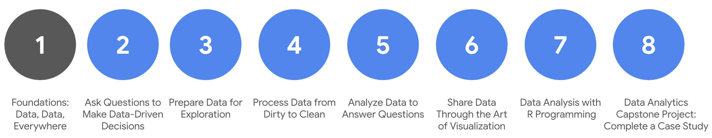

# Google_Data_Analytics_Certificate_Course_Notes
This repository is a copy of my notes taken during the learning of the [Google Data Analytics Professional Certificate](https://www.coursera.org/professional-certificates/google-data-analytics) courses on Coursera.

For more information, please visit my [Blog](https://notes.kanon.dev/my-notes).

## Course syllabus

The [Google Data Analytics Professional Certificate](https://www.coursera.org/professional-certificates/google-data-analytics) course is comprised of 8 subcourses. Each subcourse requires about 4 to 5 weeks of study. (Official statement, but absolutely you can learn it quicker, like 5 times more :) 

## Roadmap

### Foundations
**What you will learn:**

-   Real-life roles and responsibilities of a junior data analyst
-   How businesses transform data into actionable insights
-   Spreadsheet basics
-   Database and query basics
-   Data visualization basics

**Skill sets you will build:**
-   Using data in everyday life
-   Thinking analytically
-   Applying tools from the data analytics toolkit
-   Showing trends and patterns with data visualizations
-   Ensuring your data analysis is fair

### Ask
**What you will learn:**
-   How data analysts solve problems with data
-   The use of analytics for making data-driven decisions
-   Spreadsheet formulas and functions
-   Dashboard basics, including an introduction to Tableau
-   Data reporting basics

**Skill sets you will build:**
-   Asking SMART and effective questions
-   Structuring how you think
-   Summarizing data
-   Putting things into context
-   Managing team and stakeholder expectations
-   Problem-solving and conflict-resolution

### Prepare
**What you will learn:**
-   How data is generated
-   Features of different data types, fields, and values
-   Database structures
-   The function of metadata in data analytics
-   Structured Query Language (SQL) functions

**Skill sets you will build:**
-   Ensuring ethical data analysis practices
-   Addressing issues of bias and credibility
-   Accessing databases and importing data
-   Writing simple queries
-   Organizing and protecting data
-   Connecting with the data community (optional)

### Process
**What you will learn:**
-   Data integrity and the importance of clean data
-   The tools and processes used by data analysts to clean data
-   Data-cleaning verification and reports
-   Statistics, hypothesis testing, and margin of error
-   Resume building and interpretation of job postings (optional)

**Skill sets you will build:**
-   Connecting business objectives to data analysis
-   Identifying clean and dirty data
-   Cleaning small datasets using spreadsheet tools
-   Cleaning large datasets by writing SQL queries
-   Documenting data-cleaning processes

### Analyze
**What you will learn:**
-   Steps data analysts take to organize data
-   How to combine data from multiple sources
-   Spreadsheet calculations and pivot tables
-   SQL calculations
-   Temporary tables
-   Data validation

**Skill sets you will build:**
-   Sorting data in spreadsheets and by writing SQL queries
-   Filtering data in spreadsheets and by writing SQL queries
-   Converting data
-   Formatting data
-   Substantiating data analysis processes
-   Seeking feedback and support from others during data analysis

### Share
**What you will learn:**
-   Design thinking
-   How data analysts use visualizations to communicate about data
-   The benefits of Tableau for presenting data analysis findings
-   Data-driven storytelling
-   Dashboards and dashboard filters
-   Strategies for creating an effective data presentation

**Skill sets you will build:**
-   Creating visualizations and dashboards in Tableau
-   Addressing accessibility issues when communicating about data
-   Understanding the purpose of different business communication tools
-   Telling a data-driven story
-   Presenting to others about data

### Act
**What you will learn:**
-   Programming languages and environments
-   R packages
-   R functions, variables, data types, pipes, and vectors
-   R data frames
-   Bias and credibility in R
-   R visualization tools
-   R Markdown for documentation, creating structure, and emphasis

**Skill sets you will build:**
-   Coding in R
-   Writing functions in R
-   Accessing data in R
-   Cleaning data in R
-   Generating data visualizations in R
-   Reporting on data analysis to stakeholders

### Capstone
**What you will learn:**
-   How a data analytics portfolio distinguishes you from other candidates
-   Practical, real-world problem-solving
-   Strategies for extracting insights from data
-   Clear presentation of data findings
-   Motivation and ability to take initiative

**Skill sets you will build:**
-   Building a portfolio
-   Increasing your employability
-   Showcasing your data analytics knowledge, skill, and technical expertise
-   Sharing your work during an interview
-   Communicating your unique value proposition to a potential employer

## My opinion about this course

Not that hard, not that easy. A convenient all-encompassing course for entry-level data analysts.

Much of the parts in this courses are non-programming-related knowledge, so if you like me are a computer science based person, you may feel confused and boring.

But it did cover knowledge points what I need but didn't recognize before.

